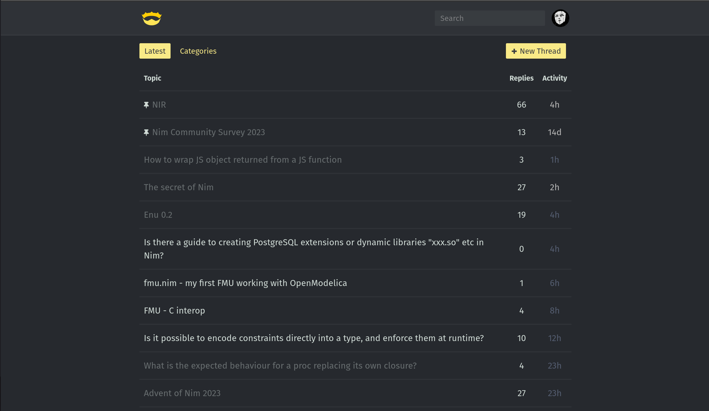
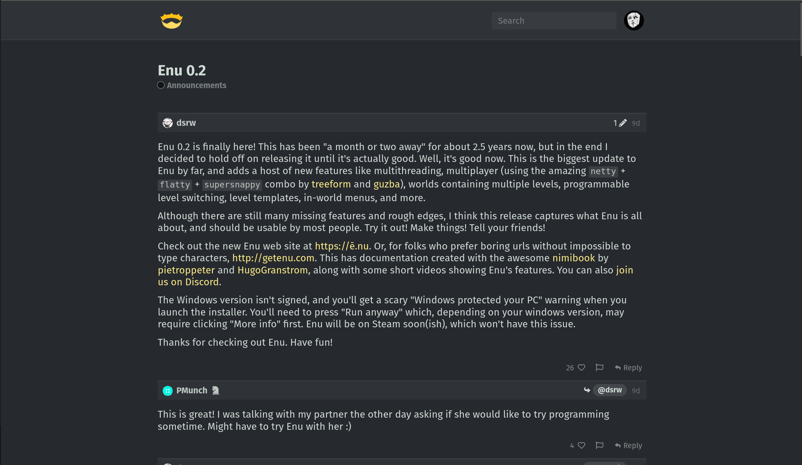
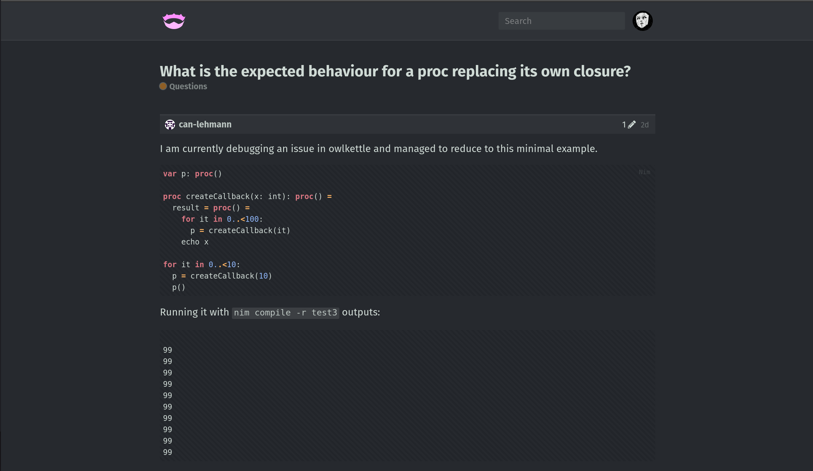

# Nimforum theme

A custom CSS stylesheet for https://forum.nim-lang.org/

## Installation

I use the [Stylus browser extension](https://add0n.com/stylus.html).

After installing the extension ([Chrome](https://chromewebstore.google.com/detail/stylus/clngdbkpkpeebahjckkjfobafhncgmne), [Firefox](https://addons.mozilla.org/en-GB/firefox/addon/styl-us/)), navigate to https://forum.nim-lang.org/, click "Write style for forum.nim-lang.org" and paste in the [theme.css](theme.css) from this repo.

